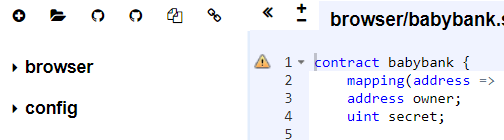
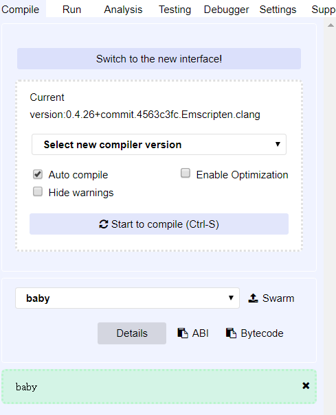
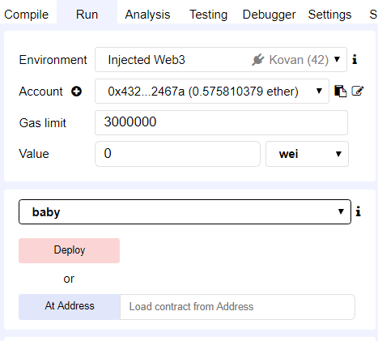
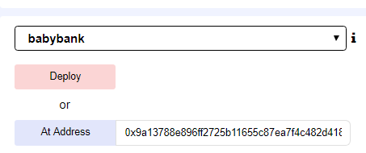
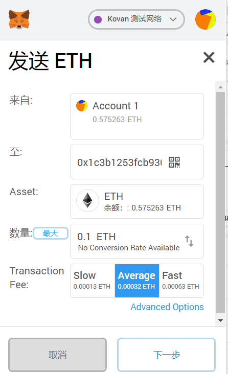
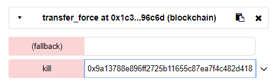
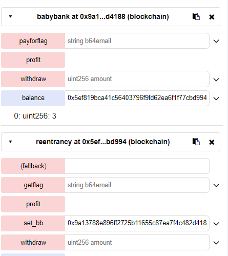

## babybank

### 使用手册

> **部署网址**	[http://remix.ethereum.org](http://remix.ethereum.org/)
>
> **以太钱包**	MetaMask
>
> 部署过程
>
> * 点击➕新建，复制粘贴.sol文件内容（用solidity语言编写）
>
>   
>
> * 设置自动编译，设置编译器版本
>
>   
>
> * 注意环境，部署或者按地址部署，部署完周就可以玩函数了
>
>   

### 题目分析

**定位**：**重入漏洞**+**强制转账**+**整型溢出**

解题逻辑：获得flag需要有一亿的账户余额，观察babybank内函数，withdraw先转账后更新存在重入漏洞并且存在减法运算可以整型溢出。执行withdraw需要设置参数为2，调用者账户余额为3，且银行有钱转账。profit函数正好可以增加调用者账户余额3。

梳理逻辑发现，大概流程为：

1. reentracy为执行攻击的账户，调用babybank中的函数，包括profit函数、withdraw函数、getflag函数，其payable属性函数内部也调用了withdraw函数，参数为2，会在受到转账的时候被调用，仅调用一次，则可想到当第一次调用withdraw函数转账的时候，触发具有payable属性的函数，由于此时并未数据更新，又执行一次withdraw函数，总共减少4元，大于3元账户，所以溢出为巨大的正数。
2. 为了让银行可以执行转账操作，需要预先给银行钱，由于银行没有payable属性的函数，不能直接转账，发现合约有selfdestruct(to)可以进行强制转账。

### 具体操作

> 1. 先部署项目：babybank部署在题目给定的地址，其它合约直接部署即可
>
>    
>
> 2. 向自杀账号中存入一点钱
>
>    
>
> 3. 账号自杀
>
>    
>
> 4. 开始攻击，先设置绑定银行，然后点击profit获得利息
>
>    
>
> 5. withdraw设置参数2，溢出成功，输入base64编码的邮箱即可。