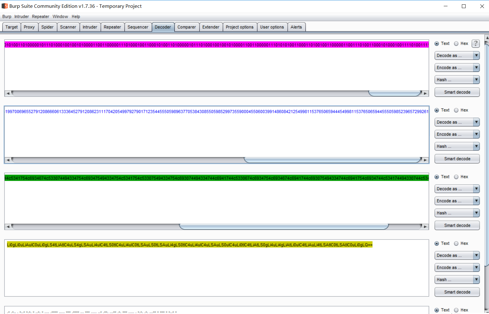

Enc-writeup

Python知识：

```
int(x, base=10) 函数用于将一个字符串或数字转换为整型。
x -- 字符串或数字。
base -- x的进制数，默认十进制。

libnum库
libnum.n2s(n):将n(整型)转换为字符串
```

坑的是解出来的莫斯密码是`ALEXCTFTH15O1SO5UP3RO5ECR3TOTXT`

要手动变成ALEXCTF{TH15_1S_5UP3R_5ECR3T_TXT}才行……

```python
import libnum
f = open('zero_one','r')
s = f.read()
output = ''
for i in s.split():
	if('ZERO' == i):
		output += '0'
	if('ONE' == i):
		output += '1'
output = int(output,2)
print output
print libnum.n2s(output)
```

附录：
用记事本打开文件，充满了zero和one字符。
将zero和one替换成1和0得到一串二进制
根据提示编码可知需要将二进制文件转换成其它形式
可以使用burpsuite自带的编码和解码功能


首先是作为二进制解码，会转换为10进制的表示，然后编码为十六进制，十六进制解码为ASCII hex，看到==作为base64解码，得到摩斯密码。

从文字到0、1的映射称为编码，反过来从0、1到文字叫解码

当你要转换成其它表示形式就是编码，文字意思还是不变的

解码就是这是按照其它语言显示的意思，你现在按照我设置的这个语言，翻译一下