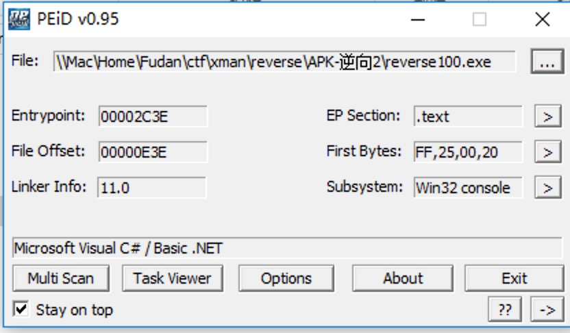
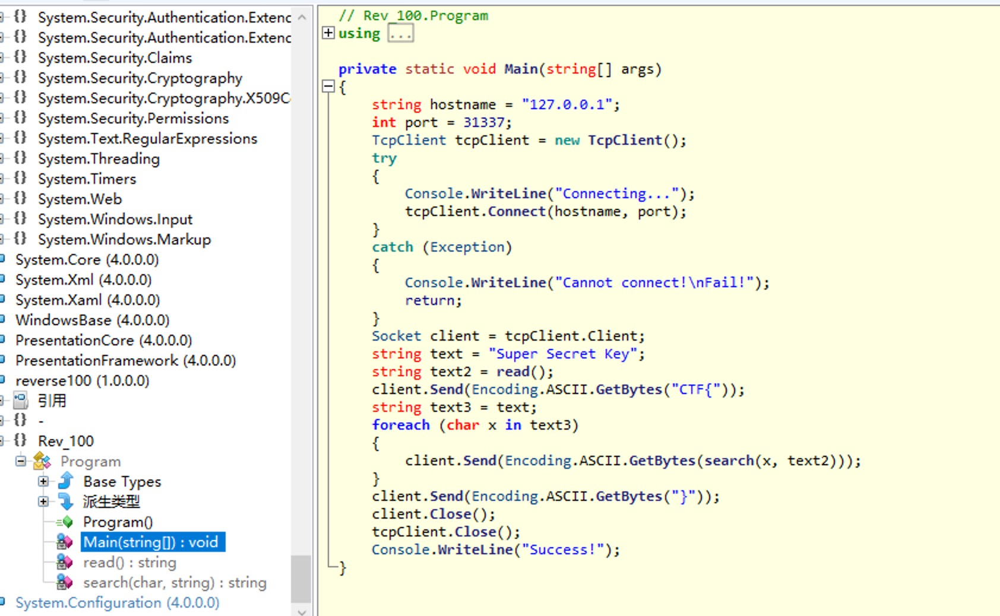

# Reverse-apk-逆向2-writeup



**PEiD: 查壳工具**

**ILSpy：针对.NET平台的反编译工具**

反编译结果：



看出是向自己电脑的31337端口发送flag

不想洗看read()和search()的话，就直接监听自己电脑的31337端口再运行一次exe程序即可

（没找到windows的监听端口命令行是什么……写个python）

```python

```

