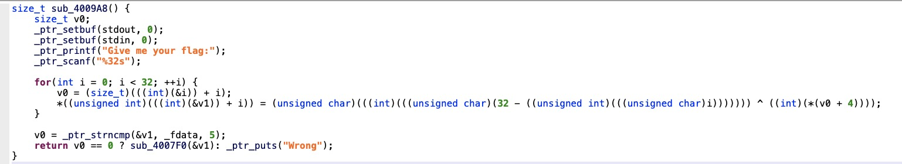
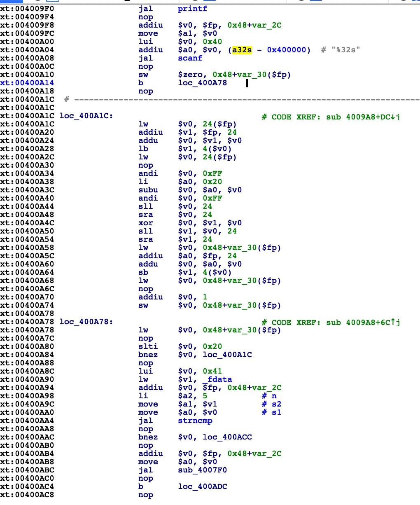
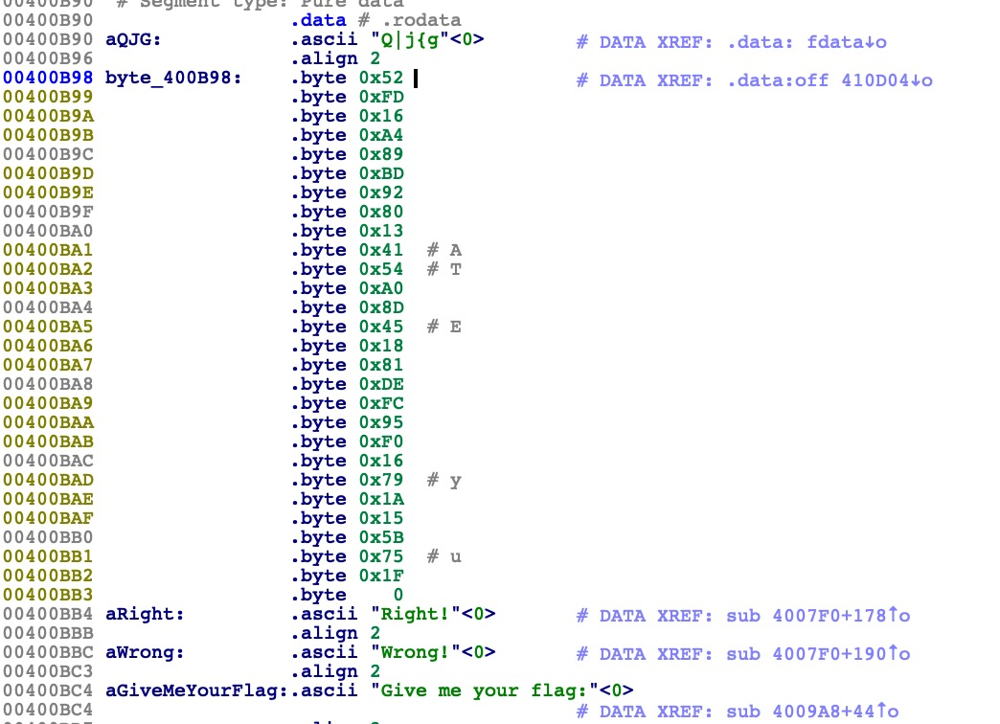
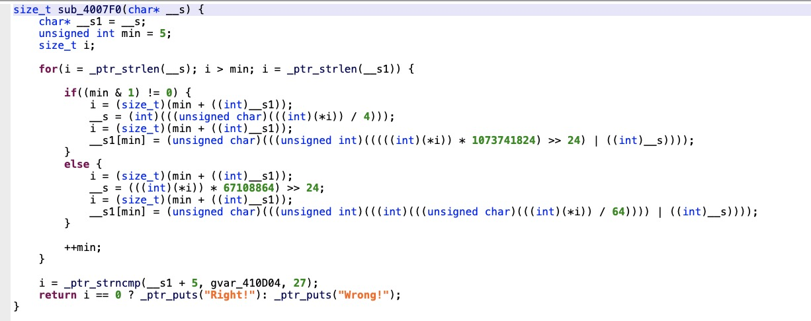

# Reverse-babymips-writeup

放进ida反编译后可以看出这个文件是用`mips`指令编写的

可以下载JEB对文件进行反编译

> JEB download: https://www.pnfsoftware.com/jeb/demomip
>
> mips指令：https://blog.csdn.net/yixilee/article/details/4316617
>
> ​					https://www.cnblogs.com/blacksunny/p/7192416.html

每个函数都看一下，找到开始的函数



可以看出需要输入的字符串长度应该是32，&v1应该是程序存放的输入的字符串的地址，v0是局部变量i的地址往上i个。

去ida里看汇编代码



>sub_xxxx  地址xxxx处的子例程（过程/方法）
>loc_xxxx  地址xxxx处的一个指令
>byte_xxxx  位置xxxx处的8位数据
>unk_xxxx  位置xxxx处的大小未知的数据
>
>.text:00401020 ; Attributes: bp-based frame
>.text:00401020
>.text:00401020 ; int cdecl sub_401020(char *)
>.text:00401020 sub_401020  proc near   ; CODE XREF: sub_401005

>.text:00401020 

>.text:00401020 var_4C  = byte ptr -4Ch      //IDA提供的一个摘要栈视图，列出栈帧内被直接引用的每一个变量，以及大小与帧指针的偏移量
>.text:00401020 var_C   = byte ptr -0Ch         // `var_`为局部变量名称的前缀，后面表示变量与被保存的帧指针之间距离
>.text:00401020 var_4   = dword ptr -4
>.text:00401020 arg_0   = dword ptr  8         // 函数参数名以`arg_`为前缀，后面表示与最顶端参数之间的相对距离(十六进制)

首先在`0x4009F8`看出`scanf`函数将字符串放在变量`var_2C`处,`0x400A10`看出变量`i`在`var_30`处

所以`i`距离字符串的位置差距`0x30-0x2c=0x4`,就可以看出函数里异或符号后面的其实是字符串第`i`个字符

第一个函数的加密方法是对字符串每个字符`s[i] ^= (32-i)`

然后加密后的字符串前`5`个字符需要和`_fdata`一致，ida里可以看见`_fdate`是 `Q|j{g`




然后看`sub_4007F0`



这个函数循环里的意思大概是：

```c
index = 5
if(index % 2 = 1){
  __s = s[index] >> 2;
  s[index] = (s[index] << 6)| __s;
}else{
  __s = s[index] << 2;
  s[index] = (s[index] >> 6)| __s;
}
index++；
```

ABCDEFGH会根据字符的奇偶变成GHABCDEF或CDEFGHAB

最后字符的后27位要和存在`0x400B98`的那串字符一致就可通过

```python
first = b'Q|j{g'
last = b'\x52\xFD\x16\xA4\x89\xBD\x92\x80\x13\x41\x54\xA0\x8D\x45\x18\x81\xDE\xFC\x95\xF0\x16\x79\x1A\x15\x5B\x75\x1F'

f = ''

for i in range(5):
    f += chr(ord(first[i]) ^ (0x20 - i))

for i in range(27):
    if i % 2 == 1:
        f += chr((((ord(last[i]) & 0b11111100) >> 2 ) | ((ord(last[i]) & 0b00000011) << 6 )) ^ (0x20 - 5 - i))
    else:
        f += chr((((ord(last[i]) & 0b00111111) << 2 ) | ((ord(last[i]) & 0b11000000) >> 6 )) ^ (0x20 - 5 - i))

print(f)
```

p.s. python语法—字符串前面的符号意义

>第一种情况b
>python3.x里默认的str是(py2.x里的)unicode, bytes是(py2.x)的str, b”“前缀代表的就是bytes ；
>python2.x里, b前缀没什么具体意义， 只是为了兼容python3.x的这种写法。
>
>第二种情况r
>常用于正则表达式或文件绝对地址等，该字母后面一般一般接转义字符，有特殊含义的字符。所以，要使用转义字符，通常字符串前面要加r。
>
>第三种情况u
>
>u后面的字符串表示使用Unicode编码，因为中文也有对应的Unicode编码，所以常用于中文字符串的前面，防止出现乱码.
>
>

