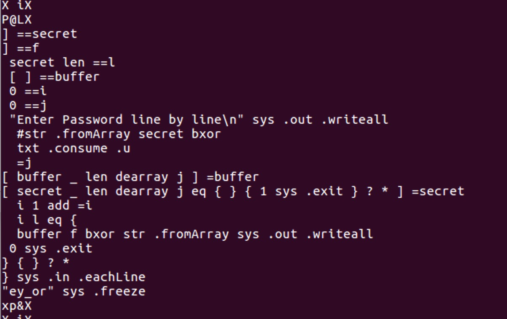

# Reverse-ey-or-Writeup

= =整个理解过程非常玄幻 https://blukat29.github.io/2015/12/32c3ctf-ey_or/

首先看程序里有哪些可以显示出来的字符串

> linux命令：strings ./ey_or 

### 逆向经常可以通过搜索常量、字符串寻找开源代码

看见众多查找结果中有一段



大佬说这是Elymas语言https://github.com/Drahflow/Elymas

在研究过Elymas语法后上面的代码的意思大致为

*python 子进程语法

```python
secret = [ ???? ]
f = [ ???? ]
l = len(secret)
buffer = []
i = 0
j = 0
print "Enter Password line by line"
for line in sys.stdin.readlines():
    j = read_int(line)
    buffer = buffer + [j]
    if secret[i] != j:
        sys.exit(1)
    i += 1
    if i == l:
        print to_string(map(lambda x,y: x^y, buffer, f))
        sys.exit(0)
```

根据这个不等于返回终止码1可以写出爆破程序：

```python
import sys
import subprocess

ans = []
while True:
    for j in range(256):
        if j % 16 == 15:
            print j
        p = subprocess.Popen("./ey_or.elf", stdin=subprocess.PIPE, stdout=subprocess.PIPE)
        for x in ans:
            p.stdin.write(str(x) + '\n')
        p.stdin.write(str(j) + '\n')
        p.stdin.close()
        ret = p.wait()
        if ret != 1:
            ans.append(j)
            print ans
            break
```

爆破结果：

```
[36, 30, 156, 30, 43, 6, 116, 22, 211, 66, 151, 89, 36, 82, 254, 81, 182, 134, 24, 90, 119, 6, 88, 137, 64, 197, 251, 15, 116, 220, 161, 94, 154, 252, 139, 11, 41, 215, 27, 158, 143, 140, 54, 189, 146, 48, 167, 56, 84, 226, 15, 188, 126, 24]
```

`You got the Flag: 32C3_wE_kNoW_EvErYbOdY_LiKeS_eLyMaS`