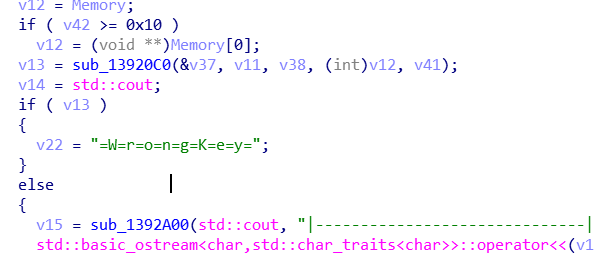
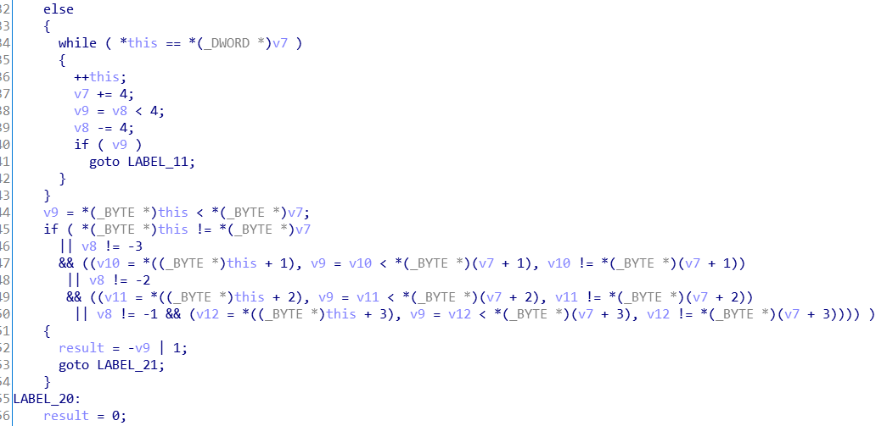

## XMan reverse key

解题思路：

用ida打开程序，可以看到main函数，调用了一个子函数

点进去子函数，然后按F5，可以看到有100多行的代码。看到这里无从下手。我们先定位关键的字符串。把代码往下拉可以看到有"Congrats you got it!"的字符串。


从这里往会看，可以看到要进入这里有一个分支语句，需要v13为0



查看这个函数，观察怎样才能为0，可以看见是在比较字符串，追溯，v7和this



v7是倒数第二个变量v12，this是第一个变量&v37


v12直接由Memory赋值，v37由Dst来，Dst进一步上溯，发现是读取的文件的内容


所以如果需要运行该程序，需要在这个路径下有一个flag.txt文件。

再来看Memory的值，发现Memory变量由某个值初始化，然后经过两次加密


Memory和&v43初始化内容为：


进去看一下sub_4021E0这个函数是做什么的。

如果继续看每个子函数会发现很难分析得清楚，所以我们现在换种思路用动态调试的方法观察这个会发生什么，直接用Ida动态调试。在sub_4021E0前面设置断点。可以发现只是将值赋给v41，这只是一个赋值函数。

则可以写出脚本：

```python
str1 = "themidathemidathemida"
str2 = ">----++++....<<<<."
 
key =""
flag=""
for i in range(18):
	key += chr((ord(str1[i]) ^ ord(str2[i]))+22)
for i in key:
	flag+=chr(ord(i)+9)
 
 
print(flag)
```

当然由于比较的字符串是存在程序内部的，也可以在比较的地方，查看内存直接得到。在调试过程中，能看到我们文件中的字符串和另一串字符进行比较，我们拷贝下来，提交正确。 


