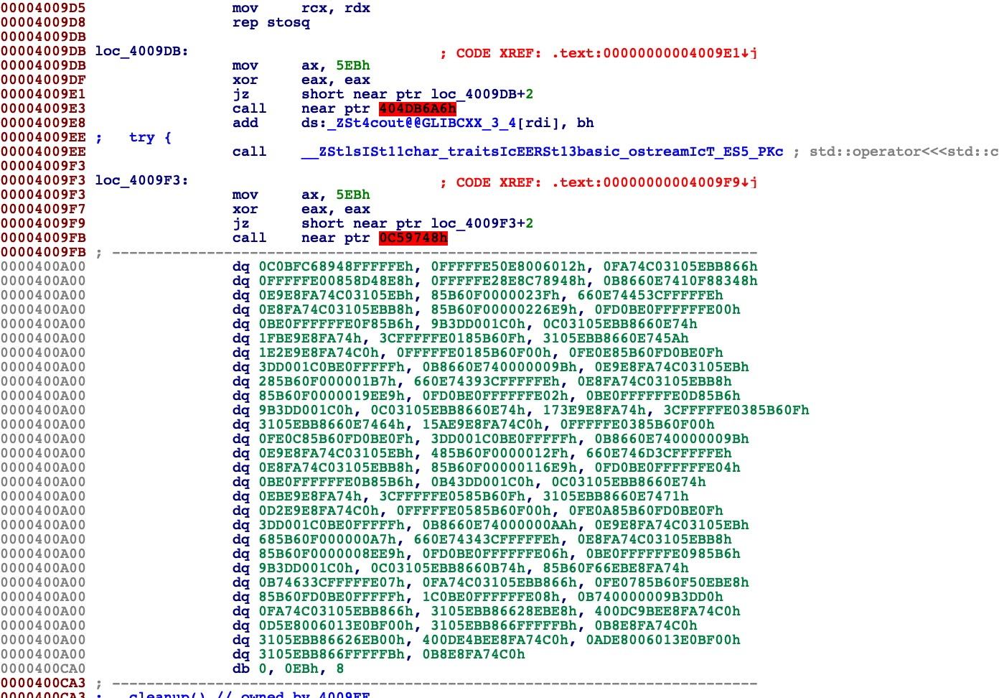
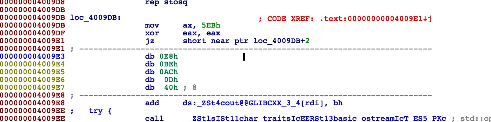
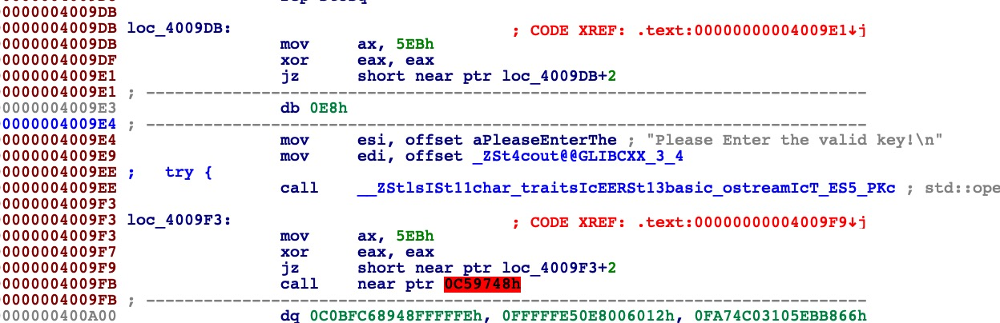
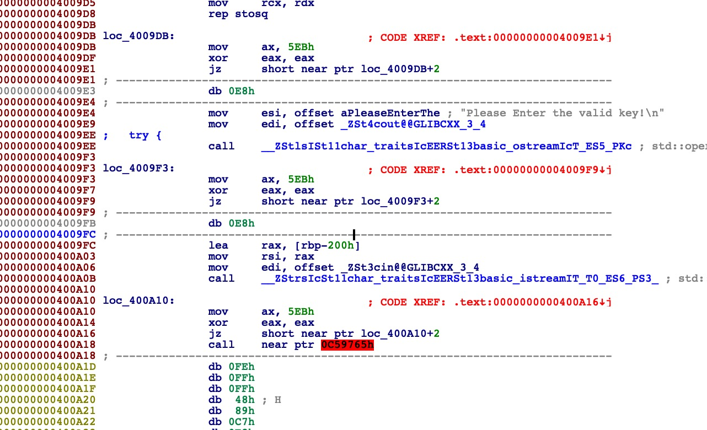
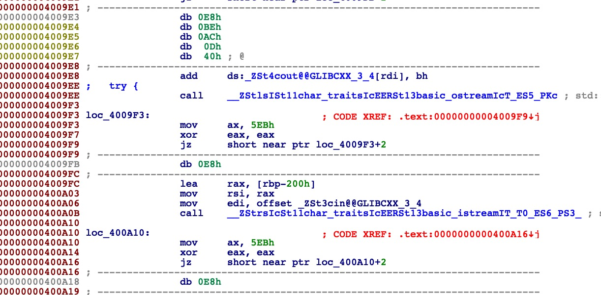
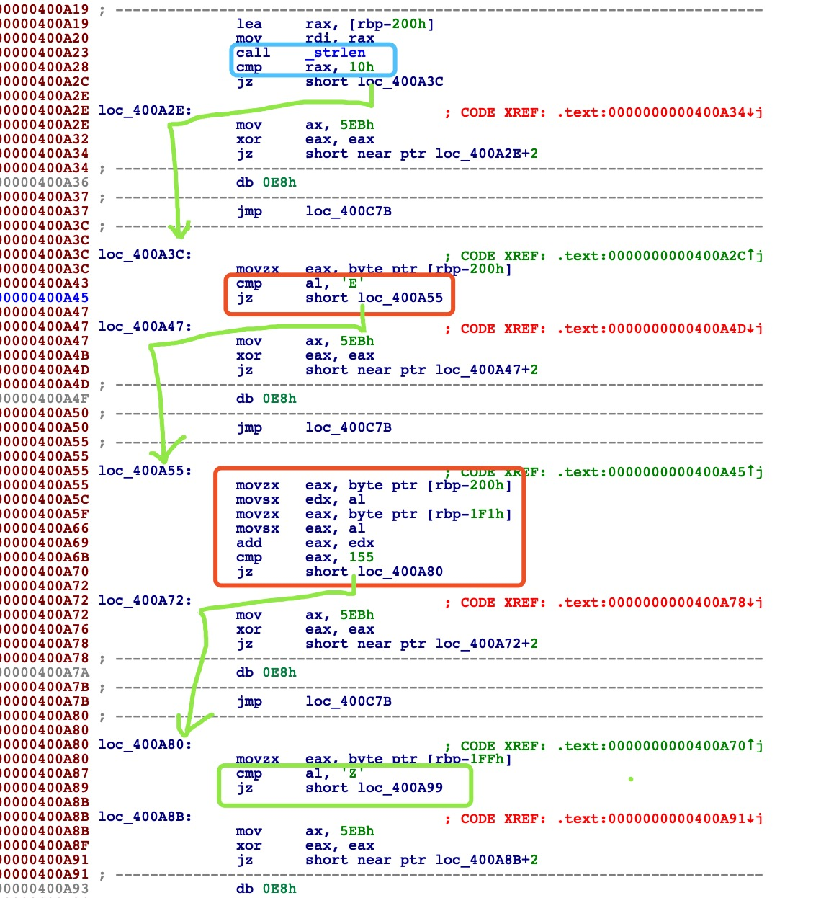

Reverse-serial-100-writeup

首先把二进制文件放进ida，发现ida会认为一部分数据是迷惑的，所以用data的形式显示了出来。

**ida用红底黑字表示的数据代表ida认为这个跳转是奇怪的（很大可能是跳转到了奇怪的地方），造成这个的原因可能是ida在反编译的过程中把不是一条指令的二进制码看做了一条指令，导致下面的机器码无法继续反编译。**

做这道题需要理解ida的`d`、`c`快捷键

> `d`：convert to data
>
> `c`:   convert to code

我们需要将这串data变成正常的code，**具体方法是：从红底的字节开始，用`d`将code转成data，然后从下一个字节开始按`s`将data转回code看代码是否正常，这个转换过程中可能会出现新的红底，此时对这个红底部分重复上面的操作，直到没有红底为止**

下面是连着第一张图看的`d`、`s`操作过程

2. 

3. 从`0x4009E3`处转化为code

   

4. 再拆分`0x4009FB`处的红底字

   

   继续拆分之后的红色显示的地方……

直到拆分到没有这一段没有红色底色出现为止。

现在开始分析程序：

注意到我们拆分后的代码最开始的`0x400A10`处有一个`istream`，猜测这个地方和我们的输入有关。

从此处往下看

`0x400A23`处调用了`strlen`函数进行比较，猜测是在比较我们输入的key的长度，需要一个0x10长度的输入值，在`0x400A3C`处断点，输入10位key和非10位key，可以看见确实触发了下面那个`jz`跳转，验证猜测。同时也可以知道`0x400A19`处的`rbp-200h`代表了我们输入的字符串的开始。

跳转到`0x400A3C`处后，又`cmp`了`%al`里是否是`'E'`，是才能跳转，所以key的第一位是`E`

跳转到`0x400A55`处后，又`cmp`了`rbp-200h`和`rbp-1F1h`里的和是否是155，`rbp-1F1h`距离`rbp-200h`间隔15，即16位长度的key的最后一位是`chr(155-ord('E'))='V'`

这些比较之后才能继续跳转，重复上面两个过程，可以得到key为`EZ9dmq4c8g9G7bAV`

